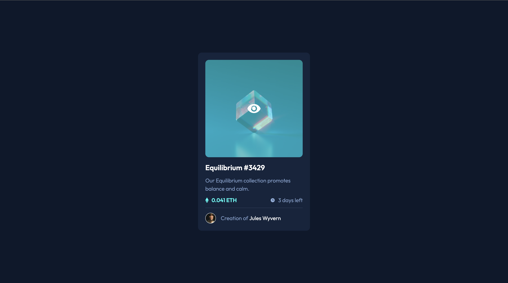

# Frontend Mentor - NFT preview card component solution

This is a solution to the [NFT preview card component challenge on Frontend Mentor](https://www.frontendmentor.io/challenges/nft-preview-card-component-SbdUL_w0U).

## Table of contents

- [Overview](#overview)
  - [The challenge](#the-challenge)
  - [Screenshot](#screenshot)
  - [Links](#links)
- [My process](#my-process)
  - [What I learned](#what-i-learned)
  - [Continued development](#continued-development)
  - [Useful resources](#useful-resources)
- [Author](#author)

## Overview

### The challenge

Users should be able to:

- View the optimal layout depending on their device's screen size
- See hover states for interactive elements

### Screenshot



### Links

- Live Site URL: <a href="https://frontend-mentor-nft-preview-card-711bb.web.app/" target="_blank">Click Here</a>

## My process

### What I learned

The main thing I learned from this challenge was how to implement image overlay on hover. It was frustrating because I didn't know how to implement this feature I kept trying to add it as a background image and it kept didn't work but after a quick google and reading some docs from w3schools and stackoverflow I could implement it without any issue.

```css
.img_container {
	position: relative;
	border-radius: 0.75rem;
}

.img_overlay {
	border-radius: 0.75rem;
	position: absolute;
	top: 0%;
	left: 0%;
	width: 100%;
	height: 100%;
	background-color: hsl(178, 100%, 50%, 0.5);
	display: none;
}
.img_overlay svg {
	position: absolute;
	top: 50%;
	left: 50%;
	transform: translate(-50%, -50%);
}

.img_container:hover .img_overlay {
	display: block;
	cursor: pointer;
}
```

### Continued development

Even thought I managed to implement the image overlay effect I still need to be more confident on more challenges similar to this as it was my first time so I will need to practice more. I also need to practice more on my CSS as it feels like im using more css selectors than needed to style my page and components.

I also need to learn how to add and implement hover effect to mobile devices.

### Useful resources

- <a href="https://www.w3schools.com/howto/howto_css_image_overlay_title.asp" target="_blank">Image Hover (W3School)</a> - This helped me understand and how to implement image overlay on hover.
- <a href="https://stackoverflow.com/questions/21086385/how-to-make-in-css-an-overlay-over-an-image" target="_blank">Image Hover (Stackoverflow)</a>- This helped me understand and how to implement image overlay on hover

## Author

- Linkedin - [Jaweed Inayathulla](https://www.linkedin.com/in/jaweedinayathulla/)
- Frontend Mentor - [@InaJaweed](https://www.frontendmentor.io/profile/InaJaweed)
